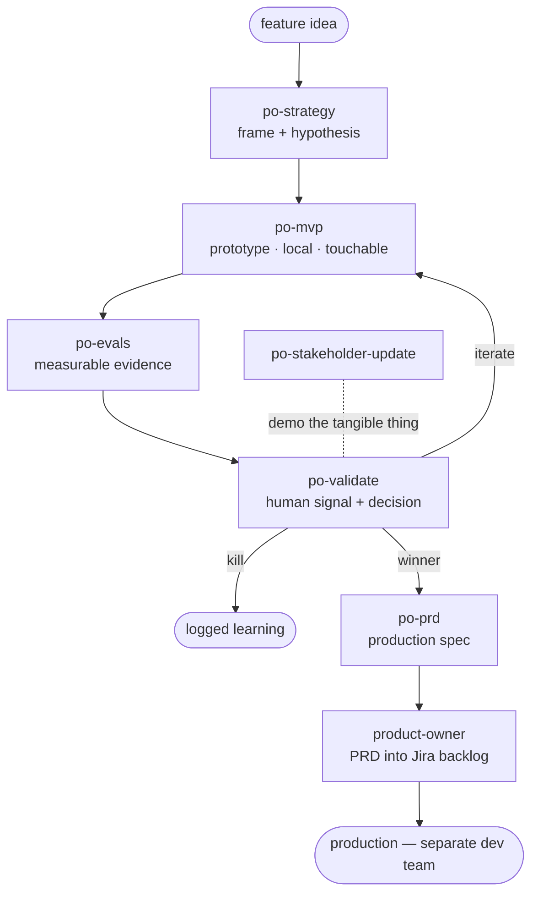

# AI-First PO workflows

A reusable team of **skills** and **subagents** for [Claude Code](https://claude.com/claude-code)
that runs the full Product Owner loop — **strategy → prototype → evals → validate → PRD → Jira → production** — with an Opus orchestrator dispatching cheap Sonnet workers.

Built for a **validation-first** way of working: every feature idea is proven on a
throwaway, touchable prototype *before* any PRD, Jira, or production commitment.
Only validated winners get handed to the production dev team.

---

## Why this exists

Most PO tooling stops at documents. This turns the PO loop into an operational
system an AI-First PO actually runs day to day:

- **Discovery and strategy** without a research bottleneck (parallel researchers).
- **Prototype-first validation** — put a tangible thing in front of people fast.
- **Evals** — replace "does this feel good?" with measurable, repeatable criteria
  and a golden-set regression suite.
- **Backlog + production handoff** only for proven winners.
- **Stakeholder comms** that lead with the tangible outcome.

---

## The flow



- **po-mvp** is early and disposable — speed to signal, not polish. Runs locally.
- **po-evals** feeds **po-validate**; it does not replace the human signal.
- **Jira + production only after a validated winner.** `kill` is a valid outcome.

See [docs/flow.md](docs/flow.md) for the detailed walkthrough.

---

## The team

### Skills — orchestrators (run on your main Opus thread)

| Skill | Role |
|-------|------|
| `po-strategy` | Discovery → decision-ready strategy brief + hypothesis (fans out researchers) |
| `po-mvp` | Idea/hypothesis → fast, touchable prototype run locally (prototype mode) |
| `po-evals` | Golden set + rubric scoring + regression suite → measurable ship/iterate/kill evidence |
| `po-validate` | Prototype → decision from human signal + eval evidence (iterate/winner/kill) |
| `po-prd` | Validated winner → production-grade PRD citing the prototype |
| `po-stakeholder-update` | Work done → status / exec / launch / Slack updates |
| `product-owner` | PRD → Jira epics/stories/tasks + print-ready roadmap HTML |

### Agents — workers (`model: sonnet`, dispatched by the skills)

| Agent | Role |
|-------|------|
| `po-researcher` | One research dimension per dispatch, cited findings, no synthesis |
| `po-prd-writer` | Drafts a PRD from a brief using the `po-prd` template |
| `po-story-writer` | PRD → Jira-ready issues; drafts locally, pushes only after confirmation |
| `mvp-planner` | Read-only implementation plan (thin slice in prototype mode) |
| `mvp-implementer` | Builds one task; TDD for production, happy-path in prototype mode |
| `mvp-reviewer` | Independent diff review, severity-tagged |
| `mvp-verifier` | "Does it run" — build/tests with real output, no unverified claims |
| `eval-judge` | Independent scorer for `po-evals`; never grades its own output |

---

## Design principles

- **Orchestrators are skills, workers are agents.** In Claude Code a subagent
  cannot spawn its own subagents, so the "manager" is your main thread (Opus)
  running an orchestrator skill, which dispatches Sonnet worker agents. This is
  what keeps cost down: Opus only for judgment/synthesis, Sonnet for the fan-out.
- **Templates live in one place.** Each skill owns its template + quality bar +
  checklist + worked example; agents invoke the skill rather than copy it.
- **Independence where it matters.** Reviewer, verifier, and eval-judge are
  separate from the implementer — a grader that wrote the code rubber-stamps it.
- **Artifacts accumulate.** Skills write to a predictable `docs/product/...` tree
  (`strategy/`, `evals/`, `validation/`, `prd/`) so a knowledge base builds up.

---

## Install

Requires Claude Code. Skills and agents are auto-discovered from `~/.claude/`.

### Global (all your projects)
```bash
./install.sh            # copies skills + agents into ~/.claude/
```

### Project-local (one repo)
```bash
./install.sh --project /path/to/repo    # copies into <repo>/.claude/
```

### Manual
```bash
cp -R skills/*   ~/.claude/skills/
cp    agents/*.md ~/.claude/agents/
```

Restart Claude Code (or start a new session) so new **agents** load. Skills are
available immediately. Verify with `/po-strategy` (skill) and by checking the
agent list.

### Optional integrations
- **Jira** (`po-story-writer`, roadmap): the Atlassian MCP server connected in
  Claude Code. Without it, issues are drafted locally to `jira-issues/`.
- **Web research** (`po-researcher`): built-in WebSearch/WebFetch, or the
  `tavily-*` / `agent-reach` skills if you have them.

---

## Usage

```
/po-strategy should we build saved filter views?      # frame + research + brief
/po-mvp prototype the top bet                          # touchable local prototype
run evals on the saved-views prototype                 # golden set + scoring
/po-validate                                           # human test + decision
/po-prd                                                # spec the winner
```

You can also skip straight to `/po-mvp` for a small bet, or invoke any worker
agent directly.

---

## Customize

Every skill is a plain `SKILL.md` (Markdown + YAML frontmatter); every agent is a
`.md` with `name`/`description`/`model`/`tools` frontmatter. Edit them to match
your domain, Jira project, tone, or eval dimensions. Keep templates in the skill
so agents stay thin.

---

## Credits

Structure and conventions (hierarchical context, quality-bar + checklist + worked
example per skill, delegation discipline, predictable artifact tree) were informed
by the [team-os-example-repo](https://github.com/in-the-weeds-hannah-stulberg/team-os-example-repo)
pattern.
