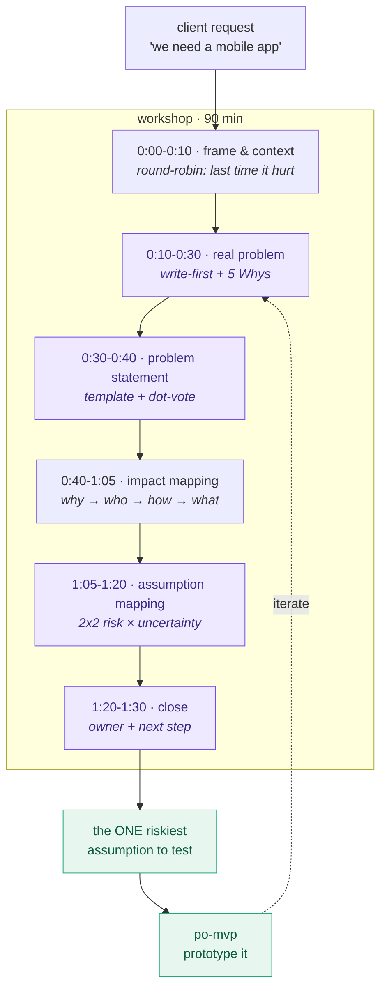
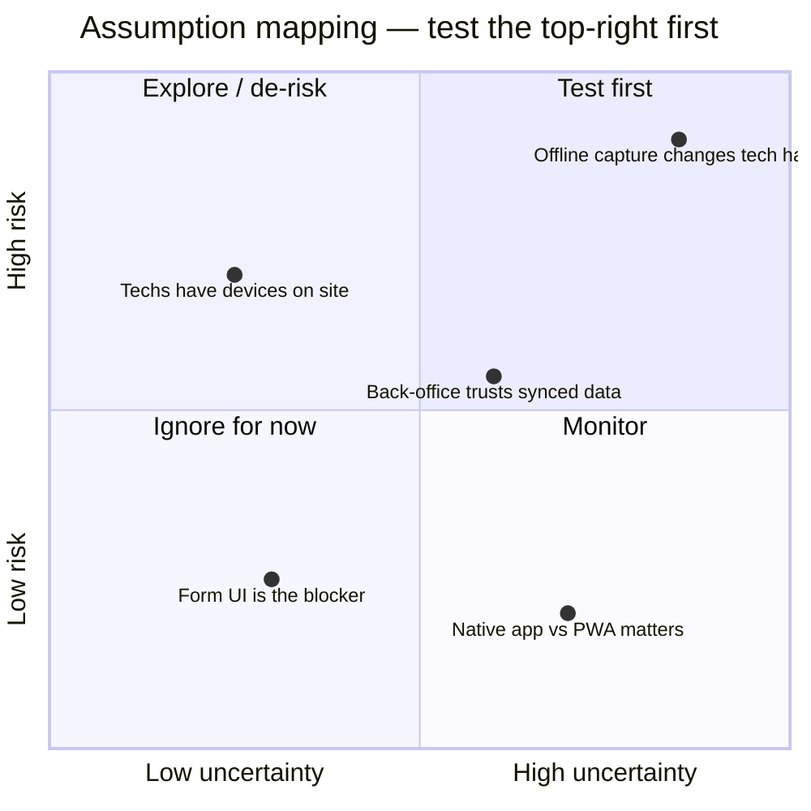
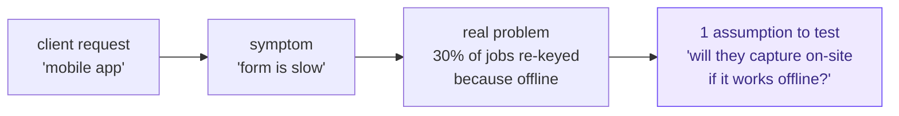

# Discovery workshop — visual guide

The problem-framing workshop that `po-discovery` preps and you facilitate. Goal:
turn a vague client request into one testable assumption — in 90 minutes.

## Flow (90 minutes)

Blocks in purple need YOUR facilitation call; green are the outputs that leave
the room. Solutions stay parked until minute 40 — the first half is problem-only.

## Assumption mapping — where to place and what to test

Test only the top-right: risky if wrong AND we don't yet know. Low-risk or
well-understood assumptions don't need a test.

The riskiest assumption ("offline capture changes the habit") is what goes to
`po-mvp` as the first prototype — cheaper to test than building the native app
the client asked for.

## The funnel (what the workshop is really doing)

See also: [facilitator-playbook.md](../skills/po-discovery/references/facilitator-playbook.md)
· [90-min agenda + script](../skills/po-discovery/references/workshop-problem-framing-90min.md).
